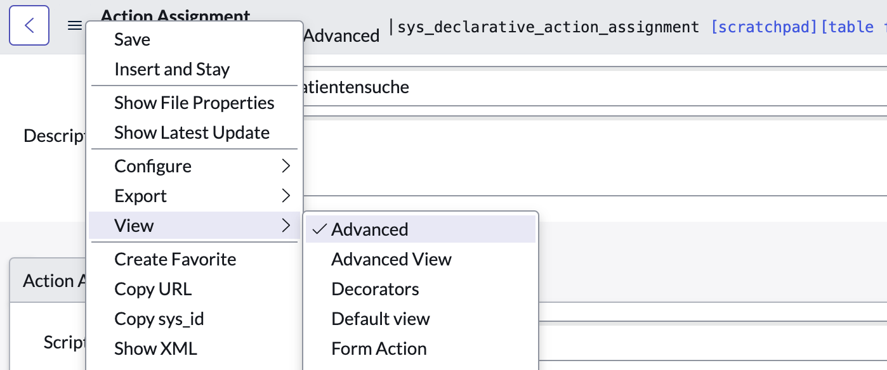
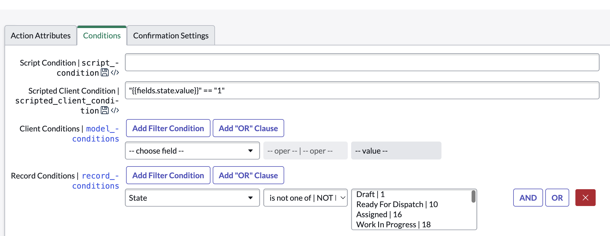

import { Steps } from 'nextra/components'
import { Callout } from 'nextra/components'

# Hiding a declarative action button without requiring a refresh

Sometimes we want to a hide a button in Configurable Workspaces based on a certain condition. This abiltiy has added in Utah and can be achieved by using Scripted Client Conditions `scripted_client_condition` on the `sys_declarative_action_assignment` record.

## Steps

<Steps>
### Prerequisites

Make sure you've created a Declarative Action.

### Open the the Declarative Action

Navigate to the `sys_declarative_action_assignment` record of choice.

### Switch to the advanced view

Right click on the the hamburger menu on the top left corner of the record and switch to the advanced view.



### Set the condition

In the `Conditions` tab set the condition using the `fields.field_name.value` syntax e.g.

```js
"{{fields.state.value}}" == "1"
```

The above would ensure the Declarative Action only shows up when the `state` field of the record is equal to `1`.



</Steps>

## Additional Information

- [Next Exp Release Notes talking about Scripted Client Conditions](https://www.servicenow.com/community/next-experience-articles/updates-to-declarative-actions-in-utah-and-vancouver/ta-p/2656503#toc-hId--1487405674)