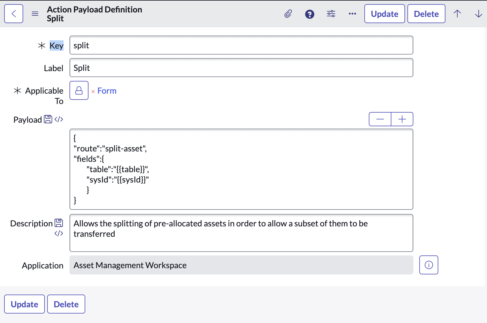
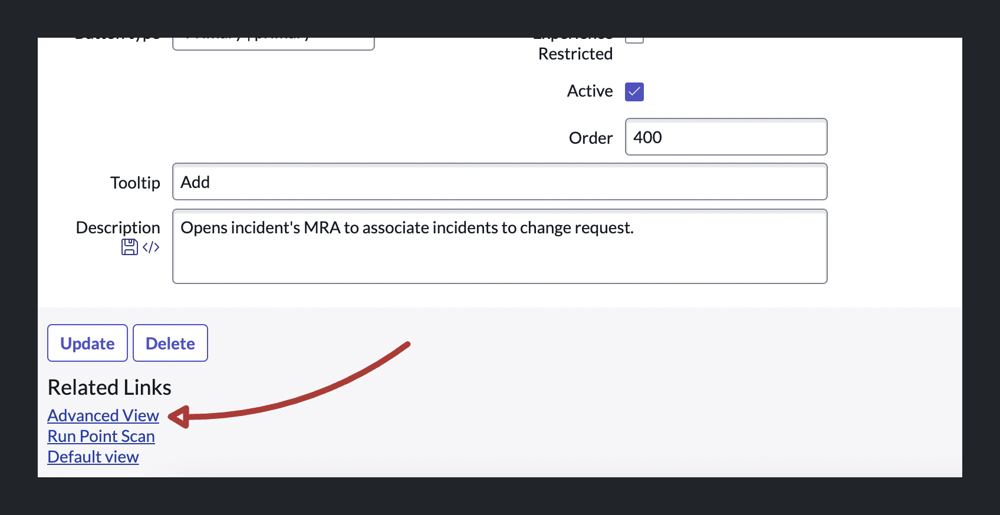
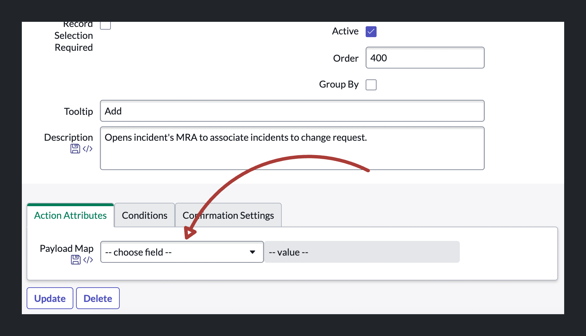

import { Steps } from 'nextra/components'
import { Callout } from 'nextra/components'

# Passing variables into modals

If you're reading this you might also be interested in the more extensive guide [on how to pass variables into a modal](../guides/passing-data-into-a-modal.mdx) from a Configurable Workspace.

## Steps

<Steps>
### Prerequisites

Make sure you've created a Declarative Action.

### Open the the Declarative Action

Navigate to the `sys_declarative_action_assignment` record of choice.

### Open the Payload Definition

Open the `sys_declarative_action_payload_definition` record that is referenced on the `client_action` field.

### Define the payload structure

On the `sys_declarative_action_payload_definition` record page you will see the `payload_template` field which is either empty or has a basic JSON object defined there. This object should contain the `route` of the UIB Page you want to open in the modal. It can also contain a `fields` key to specify required parameters to pass into the modal and a `params` key to specify optional parameters. After settling on your payload structure, you can save the Payload Definition record.

```json
{
    "route": "route-of-your-uib-page",
    "fields": {
        "someRequiredParameter": "{{requiredParameter}}"
    },
    "params": {
        "someOptionalParameter": "{{optionalParameter}}"
    }
}
```



### Open the advanced view of the Declarative Action

Back on the Declarative Action (`sys_declarative_action_assignment`) record, click on the Related Link `Advanced View` to open the advanced view of the record.



### Mapping values

In the advanced view there should be a Section Tab called **Action Attributes** with one field called **Payload Map**. You should now be able to select the parameters that you defined in the `sys_declarative_action_payload_definition` record. 



### Referencing dynamic values

Now we can select the parameters and tell the system what values we want to map onto them. To reference fields on the current record you need to use curly brace syntax while referencing the `fields` object, on which a key exists for each field of the record. Finally we need to reference the `value` key for that field.


### Adding parameters to your UIB Page

Make sure you add whatever variables you're passing to the modal as parameters to the UI Builder Page that you're using to render inside the modal.

This can be done simply by [defining the required and optional parameters of the UIB Page](../../ui-builder/defining-page-parameters.mdx).

<Callout type="warning" emoji="⚠️">
  Note that you can only access fields on the record which are visible. Accessing invisible fields will result in nothing being returned.
</Callout>


</Steps>