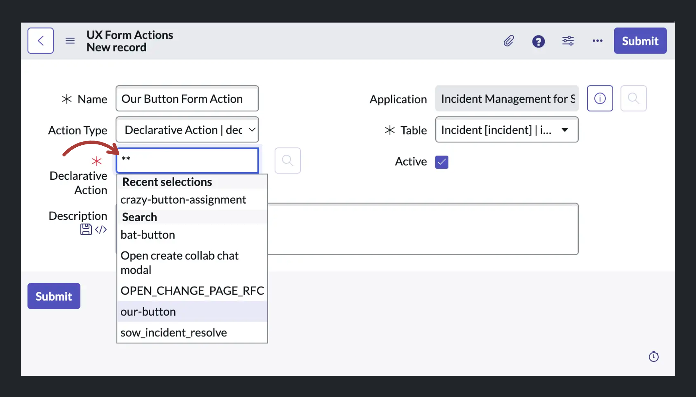

import { Tabs, Callout } from 'nextra/components'
import YouTube from '@components/youtube'

# Adding a button to the UI Action Bar

In this guide, we will be adding a button to the Action Bar of the Service Operations Workspace (SOW). The SOW is a great Workspace to customize because it ships out of the box on all instances, including developer instances. This makes it very easy to follow along. We want this particular button to only show up on records of type **Incident** (`incident`). When we're finished it should look like the image above.

This article can be seen as part of the following series:

1. How to add a button to the UI Bar of a configurable workspace (this article)
2. [How to make that button open a modal](./guide-opening-a-modal-with-declarative-actions.mdx)
3. [How to pass variables into a modal](./guide-passing-variables-into-a-modal.mdx)

<Tabs items={['Article', '▶️ Video']}>
  <Tabs.Tab>
   <Callout type="info">
   You can find the article below. If you'd like to follow along with the video, click the video tab.
   </Callout>
  </Tabs.Tab>
  <Tabs.Tab><YouTube id="cBhfn3bFPxo" /> </Tabs.Tab>
</Tabs>

## Step 1: Define a Declarative Action

From a high level there are two steps involved in getting a button to appear on a Configurable Workspace. (1) You need to declare what type of button you want and (2) you need to tell ServiceNow on what records you want it to show up. What follows is step 1.

1. Open **Now Experience Framework > Action Bar Declarative Actions** and click "New" create a new Action Assignment (`sys_declarative_action_assignment`).
2. Enter in a label e.g. "Our button".
3. Enter an action name, the convention is to write this in kebab-case like this: "our-button".
4. Keep the "Implemented as" field as "UXF Client Action"
5. On the "Specify client action" click the lookup button. 
6. In the Lookup Window click "New" to create a new Action Payload Definition (`sys_declarative_action_payload_definition`) record 
   - Enter in a key, the convention is SCREAMING_SNAKE_CASE like this: "OUR_BUTTON"
   - Make the label the same as the key
   - Under "Applicable to" only select "form"
   - Typically under payload we would specify something to make our button actually do something. But that's for a different tutorial, so we leave it empty here.
   - Click submit. 
7. Important: Keep the "Table" field on the Action Assignment set to "Global". This won't impact where the button will show up, but it _does_ impact whether the records we set up later (i.e. in the UX Form Action form) are able to access this Declarative Action Assignment.
8. Submit/Save the Action Assignment record. 

## Step 2: Add a layout item to an existing Layout

The second step is about telling ServiceNow "Hey, remember that button that we declared? Make it appear on these records."

1. Open the UX Form Action Layout list view (`sys_ux_form_action_layout`) using the menu via **Now Experience Framework > UX Form Action Layouts**.
2. Filter the UX Form Action Layout records by the Action Config value of "sow" to see only the records belonging to the **SOW Actions** Action Config. (If you're creating a button for a different Experience, you'll need to filter by a different Action Config or create a new entry here.) 
3. We want to create a button that shows up on Incident records, so go ahead and open the Incident record. 
4. First of all notice that this record is in the scope **Incident Management for Service Operations Workspace**. Scroll down to the related list "UX Form Action Layout Items". Click on the "New" button to create a new, linked Layout Item. 
5. You'll be brought to the new record form for a UX Form Actions Layout Item.
   - Start off by setting the "Table" field to the table of the record which you want to add a button to. In our case this is `incident`. (We start with this because it affects our selection in the "Action" field.)
   - As name enter "Our Button Layout Item"
   - As label enter "Our Button 👋". This is what will be shown as the button's text.
   - At the "Action" field click the lookup Icon to open the Lookup Window. 
   - Then click "New" 
   - (Note that we're opening a "Form Action" new record from a "UX Forms Actions Layout Item" new record form. ServiceNow prevents us from opening a new lookup window since we're already inside a lookup window. That's why the lookup icon is disabled here.) 
     - In the Form Action new record window enter the following:
     - For "Name" use "Our Button Form Action".
     - Set "Action Type" to "Declarative Action"
     - Set the "Table" to "Case" (`sn_customerservice_case`)
     - In the "Declarative Action" field we can't use the lookup functionality anymore, but we can type in "\*\*" to get a list of options without opening a window. You should find the Declarative Action Assignment we defined in Step 1. here. Select it and save the record. 
   - Submit/Save the "UX Form Actions Layout Item" record 
6. With the UX Form Actions Layout Item saved, you've told ServiceNow where to display the Declarative Action you defined in Step 1. Go ahead and navigate to the Service Operations Workspace (https://dev146532.service-now.com/now/sow/home) and open the "All Incidents" list in the left menu. Then open a single Incident record to see our new button. 

Note that the button doesn't do anything yet. For that we would need to define a Payload in the Payload Action Definition in Step 1.6 and map it to a Handled Event in the Configurable Workspace, but that's for a different tutorial.

## Further reading

- [Official ServiceNow Guide on Declarative Actions](https://www.servicenow.com/community/next-experience-articles/introduction-to-declarative-actions/ta-p/2332003)
- [Arnoud Kooi's Declarative Action From Record Page Video](https://www.youtube.com/watch?v=C8KDDHUvNO8)
- [Brad Tilton's Add a Button to the List Component Video](https://www.youtube.com/watch?v=lTDa8nFRvmU)
