import { Callout, Tabs } from 'nextra/components'
import YouTube from '@components/youtube'

# Opening a modal with declarative actions

In this guide, we will cover how you can make a UI Action Bar button open a modal in a Configurable Workspace. For this guide, we will be using the Service Operations Workspace.

This article can be seen as part of the following series:

1. [How to add a button to the UI Bar of a configurable workspace](./guide-adding-a-button-to-the-ui-action-bar.mdx)
2. How to make that button open a modal (this article)
3. [How to pass variables into a modal](./guide-passing-variables-into-a-modal.mdx)

<Tabs items={['Article', '▶️ Video']}>
  <Tabs.Tab>
   <Callout type="info">
   You can find the article below. If you'd like to follow along with the video, click the video tab.
   </Callout>
  </Tabs.Tab>
  <Tabs.Tab><YouTube id="E9FhNpk0Mwk" /> </Tabs.Tab>
</Tabs>

## Step 1: Create a Page & Variant in UI Builder

1. In the Application Navigator navigate to **Now Experience Framework > UI Builder** to open UI Builder.
2. On the UI Builder Home Screen under **Experiences** find and click on the Service Operations Workspace. Typically it's on page 2. 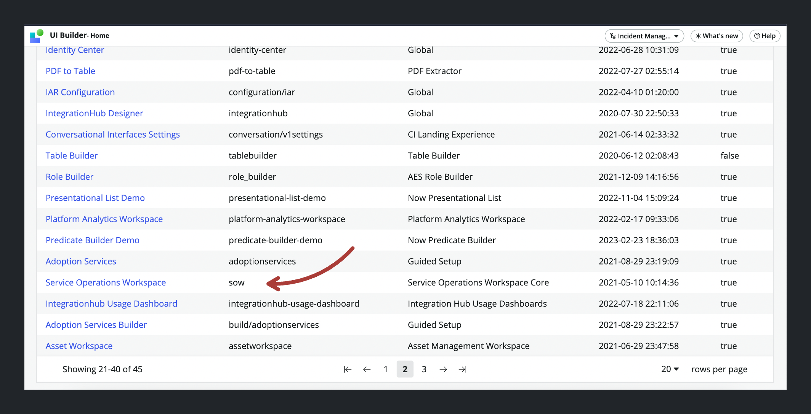
3. Click on the + button next to Pages and variants to create a new Page & Variant. 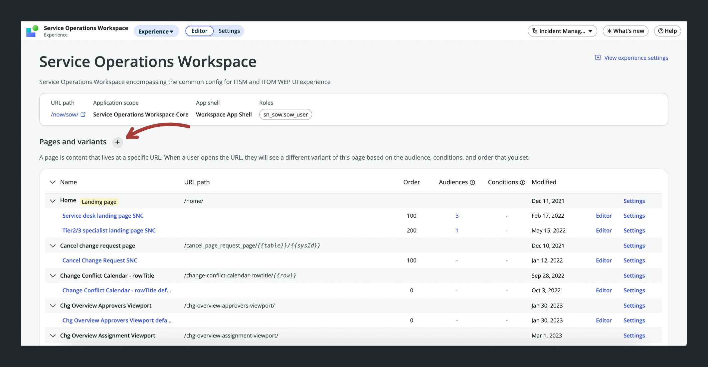
4. Click on "Create a new page" when asked to choose between creating a new page and creating a new variant.
5. On the template selection screen click on the button on the top right **Create from scratch instead**. 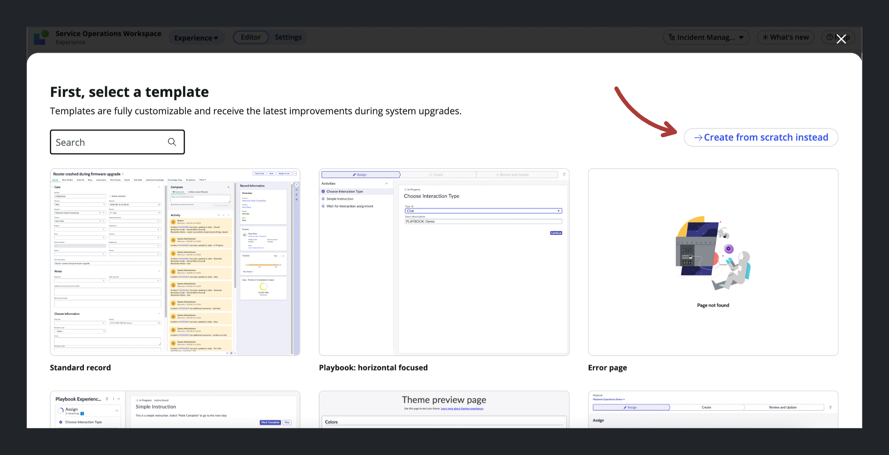
6. Set the Page name to "Our Page", this should autofill the URL path as "our-page". Finally click continue to proceed. Note: The URL path is what we need when defining the mapping between our button and the modal. 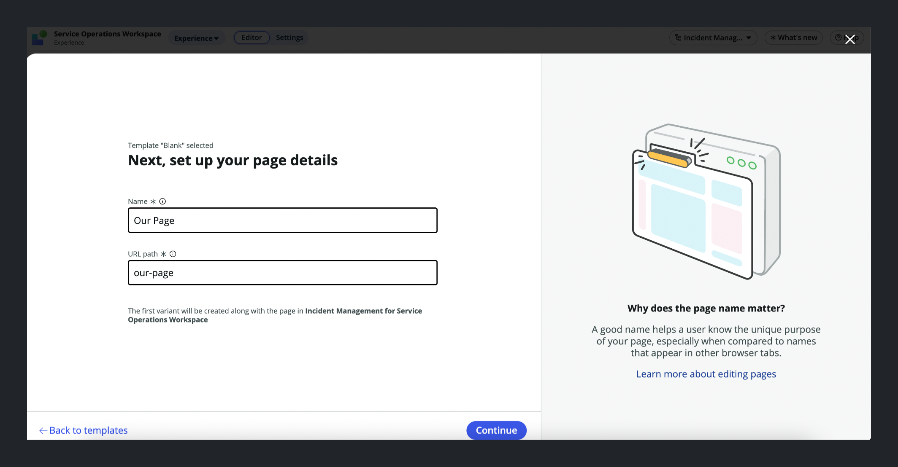
7. On the next screen add two URL Parameters for our page. One called `sysId` and one called `table`. We'll use these to pass the `sys_id` of the record and the name of the table. Finally click "Looks good" to proceed. 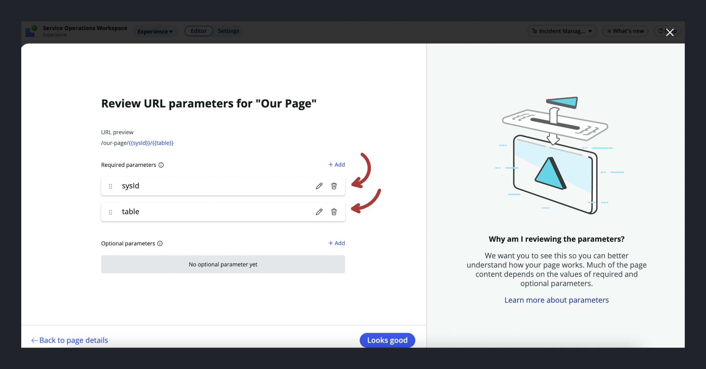
8. On the next screen ("Tell us about your variant") give your Variant a name. This will be what shows up in the Page overview. Let's call our variant "Our Variant" Leave the rest as is.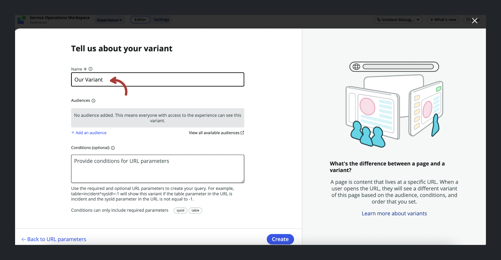
9. Our new Page & Variant should now show up in the overview of Pages. There should also be a green info message at the top of your screen with a link to editing the page. Click on either one to open the page in UI Builder.

## Step 2: Design your Variant

1. Add whatever components you want to display on the Page. In our case we can pick the "List" component which takes a `table` as a parameter and displays a list of records for that table. Click "+ Add component" underneath the Body element in the left pane and search for "List" in the Component search. Click it to place it on the canvas.
2. With the "List" component selected click on the "Table" field in the Config pane on the right. Switch to Bind data and dot-walk to the `table` prop like so: `@context.props.table`.
3. Scroll down a bit in the Config pane until you reach the "Title" field. Switch to Script mode.
   
4. Enter the following script where we pass the `sysId` received through the URL parameter as a JS template variable.

    ```js
    function evaluateProperty({ api, helpers }) {
    	return `Only ${api.context.props.sysId}`;
    }
    ```

    

5. Click "Apply" for the script and "Save" on the top right of the window to save your changes. Now the `table` and `sysId` variables are configured to be passed from from the modal, through the URL into the our Variant.

## Step 3: Configure the Variant

1. Click on the hamburger menu on the top left and navigate to Developer > Open variant collection record. This will open the `sys_ux_screen_type`.

2. On the `sys_ux_screen_type` record open the UX App Routes tab in the Related Lists section. It should have one entry called "`Our Page`" based on what we defined in Step 1. 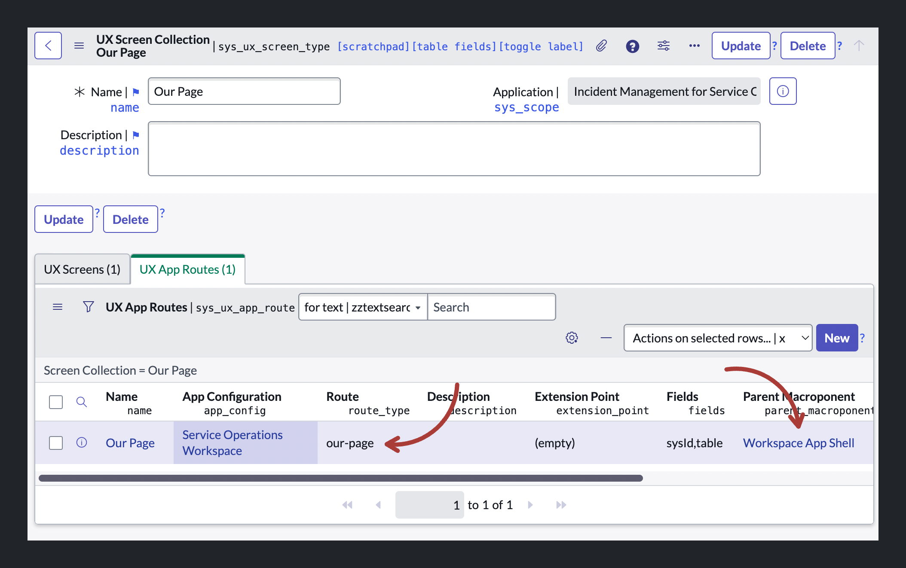


3. Here's where things are a little counterintuitive. We want to maintain the existing `sys_ux_app_route` record as is. I don't think it's needed for anything, but if we get rid of it, or if we try to use it for opening the modal, our Page and Variant will disappear from the Experience overview.

    This is why I suggest you clone it (for instance by opening it, right clicking on the top bar, and clicking "Insert and stay"). After cloning it, simply change the route on one of the records to `our-page-default`. 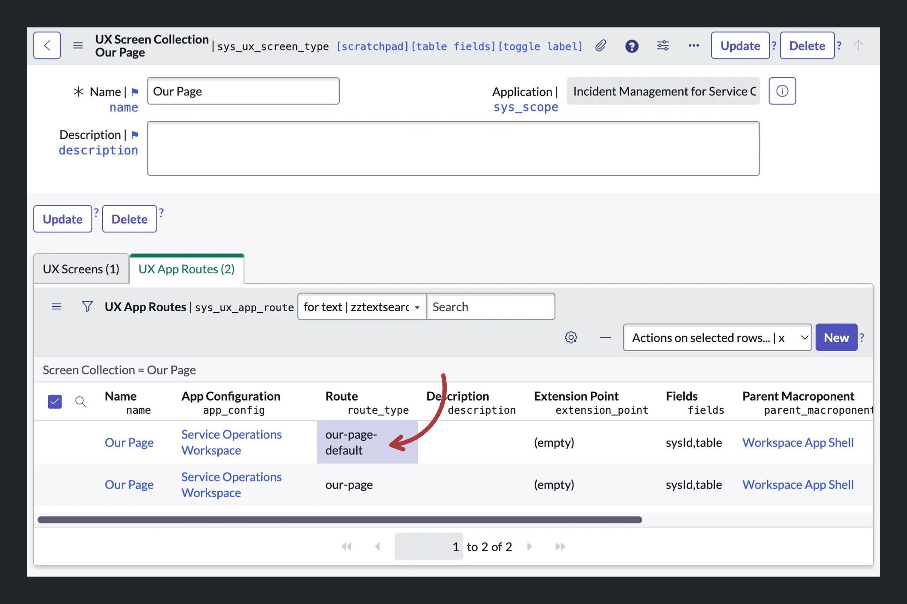

4. Then click on the record with the original route `our-page` to open it.

3. Here we need to set the **Parent Macroponent** (`parent_macroponent`) to whatever page we want our Page to appear within. Since we want to create a Modal on the Record page we can fill in "`Record sow`" here.

4. The **Parent Macroponent Composition Element ID** defines which part of the Macroponent our UI Builder Page should appear in. Since we want it to appear in a modal we can use the Service Operations Workspace's built-in modal, which has Element ID `modalContainerViewport`. 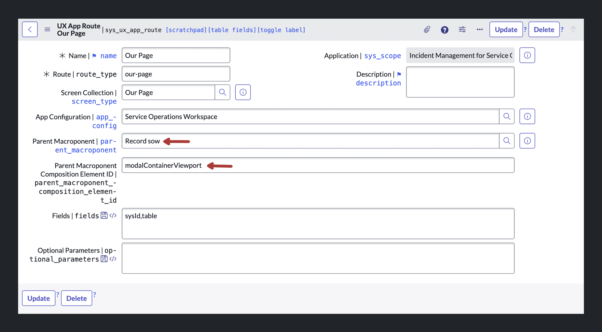

5. Leave the other fields as is and click **Update** to save the record.

## Step 4: Create a UX Add-on Event Mapping

At this point we've created a Page & Variant and we've told ServiceNow we want it to show up on the CSM/FSM Configurable Workspace record Macroponent linked to the `modalContainerViewport`.

In the [previous tutorial](https://jessems.com/posts/2023-03-13-adding-an-action-bar-button-to-a-configurable-workspace) we added a button to the Record page of a Workspace, but we stopped short of making that button do anything.

What's left is for us to connect the button with the Modal. What's more we want to pass information from the Record to the Modal. What's left for us is mapping the Button click event to the Modal launch event. The way this is done is through a UX Add-on Event Mapping Record (sys_ux_addon_event_mapping).

1. Unfortunately there is no menu link for this table, so you need to open it directly by typing in `<instance-name>.service-now.com/sys_ux_addon_event_mapping_list.do` into your browser.

2. Click **New** to create a new record.

3. Enter in a name for your map. In our case "`Our Page Map`".

4. Set "`ui_action_bar`" as the **Source element ID**.

5. Select the Declarative Action Assignment we defined in [the previous tutorial](/adding-an-action-bar-button-to-a-configurable-workspace) for the field **Source Declarative Action**. In our case that's `our-button`.

6. Set the macroponent to the "Record sow" Macroponent.

7. Selecting a Macroponent should load the options for the "Target Event" dropdown. Set this field to "[Record Page] Open modal". (If you want to trigger a different event, such as opening a tab, you need to select a different target event here.)

8. Finally in the "Target Payload Mapping" field we need to paste this JSON object. It defines which fields we'll be able to send to the Modal and you don't have to alter the structure for other use cases. We'll only be using "route" and "fields".

    ```json
    {
    	"type": "MAP_CONTAINER",
    	"container": {
    		"route": {
    			"type": "EVENT_PAYLOAD_BINDING",
    			"binding": {
    				"address": ["route"]
    			}
    		},
    		"size": {
    			"type": "EVENT_PAYLOAD_BINDING",
    			"binding": {
    				"address": ["size"]
    			}
    		},
    		"fields": {
    			"type": "EVENT_PAYLOAD_BINDING",
    			"binding": {
    				"address": ["fields"]
    			}
    		},
    		"params": {
    			"type": "EVENT_PAYLOAD_BINDING",
    			"binding": {
    				"address": ["params"]
    			}
    		}
    	}
    }
    ```

9. Finally click Submit to save the record. 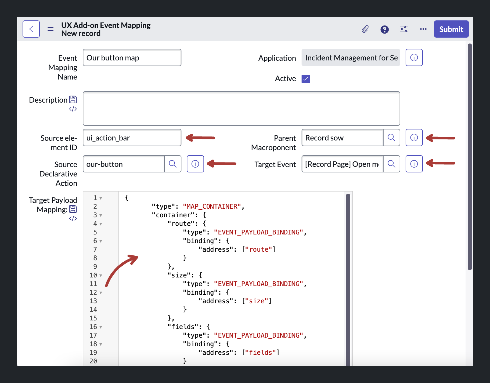

## Step 5: Define the Payload

The last remaining step is for us to define the payload of the event. Back in [the previous tutorial](/adding-an-action-bar-button-to-a-configurable-workspace) we left this field blank.

1. Navigate to **Now Experience Framework > Actions and Events > Action Bar Declarative Actions** and find the Declarative Action we defined in the previous tutorial. In our case it was called "`Our Button`". 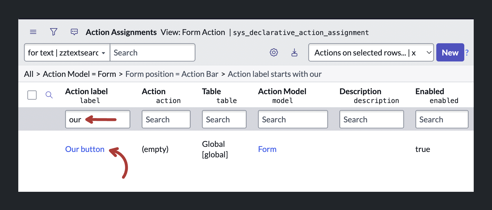

2. On the "Specify client action" field click the Record Preview button and open the record in a new tab. 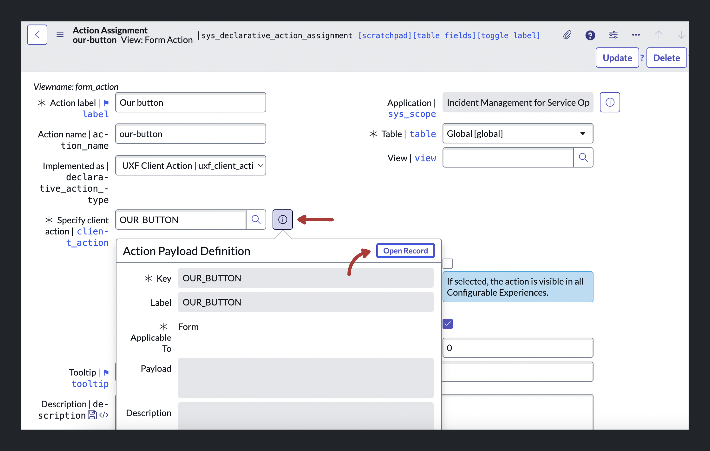

3. In the Payload field fill in the JSON object below. The `route` key tells SN where to look for our Page and we can use the `field` key to pass variables from the current context:

    ```js
     {
       "route": "crazy-page",
       "fields": {
         "table": "{{table}}",
         "sysId": "{{sysId}}"
       }
     }
    ```

4. Finally click Update to save the record. 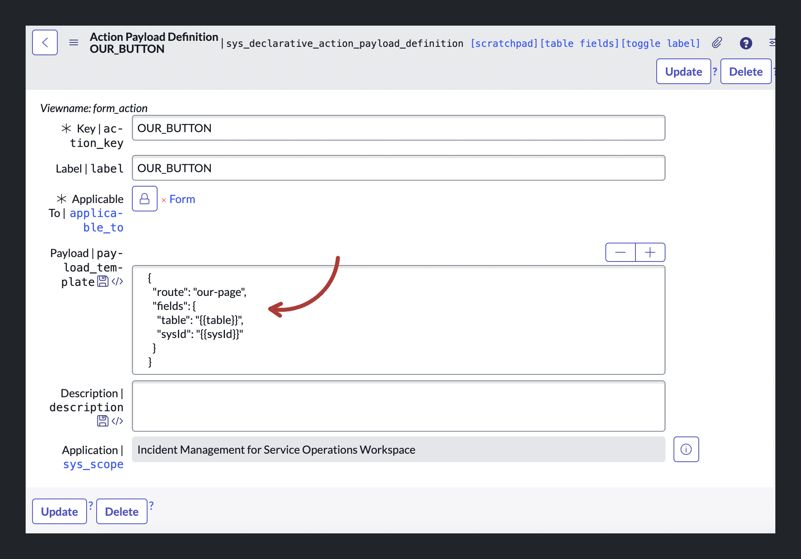

## Step 6: Test your button

Now open the CSM/FSM Configurable Workspace, navigate to the Case Record and test the button.


If you want to change the modal size, you can do so easily by adding a `size` key to the payload object in Step 4.3. Possible sizes are `sm`, `md`, `lg` and `fullscreen` e.g.

```js
  {
    "route": "crazy-page",
    "size": "fullscreen",
    "fields": {
      "table": "{{table}}",
      "sysId": "{{sysId}}"
    }
  }
```

## Resources

-   [Official ServiceNow Guide on Declarative Actions](https://www.servicenow.com/community/next-experience-articles/introduction-to-declarative-actions/ta-p/2332003)
-   [Arnoud Kooi's Declarative Action From Record Page Video](https://www.youtube.com/watch?v=C8KDDHUvNO8)
-   [Brad Tilton's Add a Button to the List Component Video](https://www.youtube.com/watch?v=lTDa8nFRvmU)
-   Special thanks to [Roy Wallimann](https://www.servicenow.com/community/user/viewprofilepage/user-id/270338) who wrote an internal BitHawk tutorial on triggering modals in workspaces