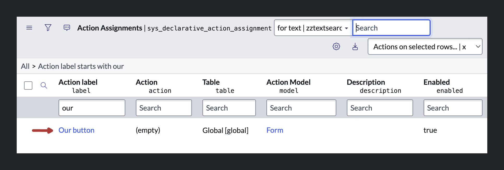
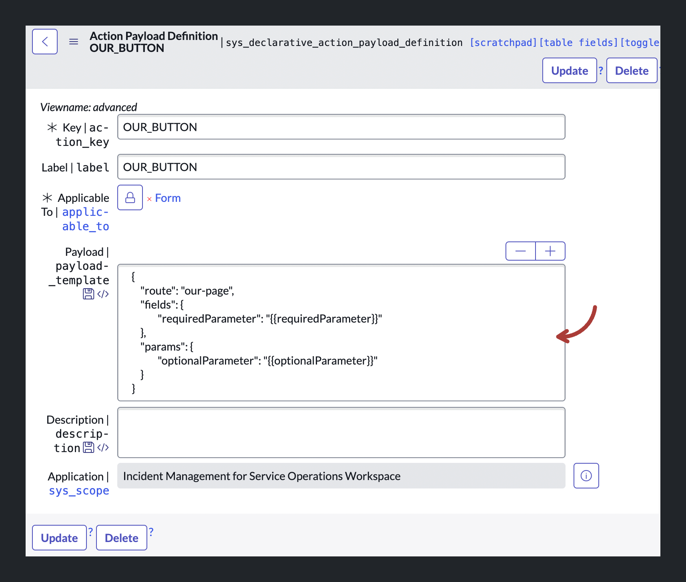

import { Steps, Callout, Tabs } from 'nextra/components'
import YouTube from '@components/youtube'

# Passing variables into a modal

This tutorial can be seen as part of the following series:

1. [How to add a button to the UI Bar of a configurable workspace](./guide-adding-a-button-to-the-ui-action-bar.mdx)
2. [How to make that button open a modal](./guide-opening-a-modal-with-declarative-actions.mdx)
3. How to pass variables into a modal (this article)

This guide assumes you've already completed the first two steps and you've got a button that opens a modal.

## What we're going to create

Here's an animated gif of what we're going to create. We're simply going to pass two values from the opened Incident record into the modal. The modal will then render those values in two Styled Text components.


## Prerequisites

-   A Configurable Workspace which you've customized with a declarative action (e.g. a button in the UI Bar) which opens a modal. (See [this tutorial](/configurable-workspaces/declarative-actions/ui-action-bar) on how to accomplish that)
-   A modal which you've hooked up to your declarative action so that when it is clicked/triggered the modal opens (See [this tutorial](/opening-modal-from-a-record-in-configurable-workspaces.mdx) on how to accomplish that)

<Tabs items={['Article', '▶️ Video']}>
  <Tabs.Tab>
   <Callout type="info">
   You can find the article below. If you'd like to follow along with the video, click the video tab.
   </Callout>
  </Tabs.Tab>
  <Tabs.Tab><YouTube id="80027gKyXfw" /> </Tabs.Tab>
</Tabs>

## Step 1: Adding the parameters to your UIB Page

In order to pass variables to your modal, you will need to define the parameters in your payload and on the UIB Page that will be rendered inside the modal.

<Steps>

### Open the UIB Page

A modal typically renders a UIB Page. If you've followed the preceding tutorial you will have already set this one up. Navigate to the UIB Page that you've configured to render inside the modal.

### Adding Parameters

With your UIB Page opened, navigate to the **Settings** tab, click on **General** in the left menu, and scroll down to the **Page parameters** section where you can define the parameters that can be passed into your page. 


Define one required parameter `requiredParameter` and one optional parameter `optionalParameter`. Finally, save the record. 


You'll get a message saying that the parameters have been synced.

### Ensure these values are set on the desired `sys_ux_app_route` as well

Depending on what steps you took to get to this point, the changes we just made might not have been updated the `sys_ux_app_route` record you intend to use for your modal.

If you were following along with the preceding tutorial you can navigate to your UIB Page, click on the **Settings** tab and open the **Variant Collection** record. There, in the related list for **UX App Routes** you'll see two records. One which we gave the `route` value of `our-page-default`, which has the updated optional and required routes.

The other `sys_ux_app_route`, however, did not have its parameters updated. You'll have to do that manually now.


### Enter in test values

Your new parameters will now be displayed at the top of your screen. Clicking them opens a modal where you can define test values. If you want, enter some test values for your new parameters here to see how they will be rendered in the components.


<Callout type="info">
Note: As of this writing there's a bug where changing the parameter values does not trigger the activation of the save button, making it impossible to save new values.
</Callout>

### Using the parameters

Create two Stylized Text components and choose the option **Configure the component manually** in the right-hand panel.

### Bind the parameters to the components.

In the config for each of the Styled Text components set the Text field to **Bind data** and set one to `@context.props.requiredParameter` and the other to `@context.props.optionalParameter`. If you've configured test values for the parameters, they should now be rendered in the Styled Text components. Finally, save your changes. 

</Steps>

## Step 2: Mapping the parameters to the payload

<Steps>

### Navigate back to the Declarative Action

Navigate back to the `sys_declarative_action_assignment` record for your button. You can find this under **Now Experience Framework > Actions and Events > UX Declarative Actions** or **Now Experience Framework > Actions and Events > Action Bar Declarative Actions** if your button is an Action Bar button.



### Open the advanced view

Click on the related link "Advanced View" to open the advanced view of the record.


### Open the Payload Definition record

There should be a Section Tab called "Action Attributes" with one field called Payload Map. Through this field we want to tell the system what values to send with the payload. But before we do that, we need to tell the system what the structure of the payload should look like now that we know we're sending a `requiredParameter` and an `optionalParameter`. To do this click on the "Preview this record" info icon next to the `client_action` field and click "Open Record" in the popup (best to open it in a new tab). 

### Define the payload structure

On the `sys_declarative_action_payload_definition` record page you will see the `payload_template` field which is either empty or has a basic JSON object defined there. Edit this field so that it looks like this, where you set the route to your UIB Page's route:

```json
{
    "route": "our-page",
    "fields": {
        "requiredParameter": "{{requiredParameter}}"
    },
    "params": {
        "optionalParameter": "{{optionalParameter}}"
    }
}
```

<Callout type="info">
    Note that you need to define all the page parameters that you're using on your UIB Page in this payload template. If you leave one out, the modal won't workspace.
</Callout>

Then save the record. 

### Map the payload keys to dynamic values

Now navigate back to the `sys_declarative_action_assignment` record for your button. Reload the page if it's still open. In the advanced view in the `payload_map` you should now be able to select the parameters that we defined. 


Now we can select the parameters and tell the system what values we want to map onto them. For this tutorial we're creating a button which is visible on Incident records and I want to pass two field values from the Incident record to the modal. The `requiredParameter` will get the `number` field value and the `optionalParamter` will get the `description` value.

<Callout type="info">
    Note that the syntax is a bit unusual here. We need to use the double curly brace syntax to tell the system we're making a dynamic reference. Then we need to reference the `fields` object, on which a key exists for each field of the record. Finally, we need to reference the `value` key for that field.
</Callout>


Save the record.

### Test it out

Now navigate to an Incident record inside the Service Operations Workspace and test out the modal. 

One of the cool features here is that you're able to pass field values that haven't been saved yet.

<Callout type="info">
    Note that you can only pass variables in this manner which are set to visible on the form. Variables that are defined on the record, but which are not displayed on the form, cannot be passed in this manner.
</Callout>

</Steps>
