## What we'll be building

We want to add a button to the Action Bar of the CSM Configurable Workspace but only on records of the type "Case" (`sn_customerservice_case`). When we're finished it should look like this:

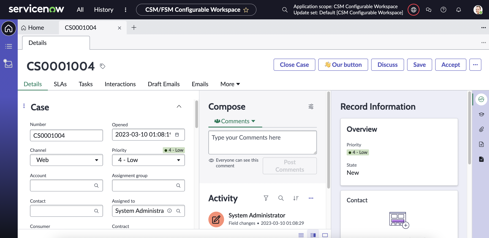

## Prerequisites

- If you want to follow along and you're on a developer instance make sure you install CSM and/or FSM/CSM plugins. You can do so by going to **System Definition > Plugins** in the menu, searching for "CSM" and clicking "Install".

## Step 0: Before we start

- The tables we will be using are all part of the same grouping in the menu which can be found under **Now Experience Framework > Actions and Events**. To make your life easier you can pin the menu bar to left side of the screen and type in "actions a" into the menu search bar to filter for only the items that are relevant for us (h/t to Arnoud Kooi for this tip). 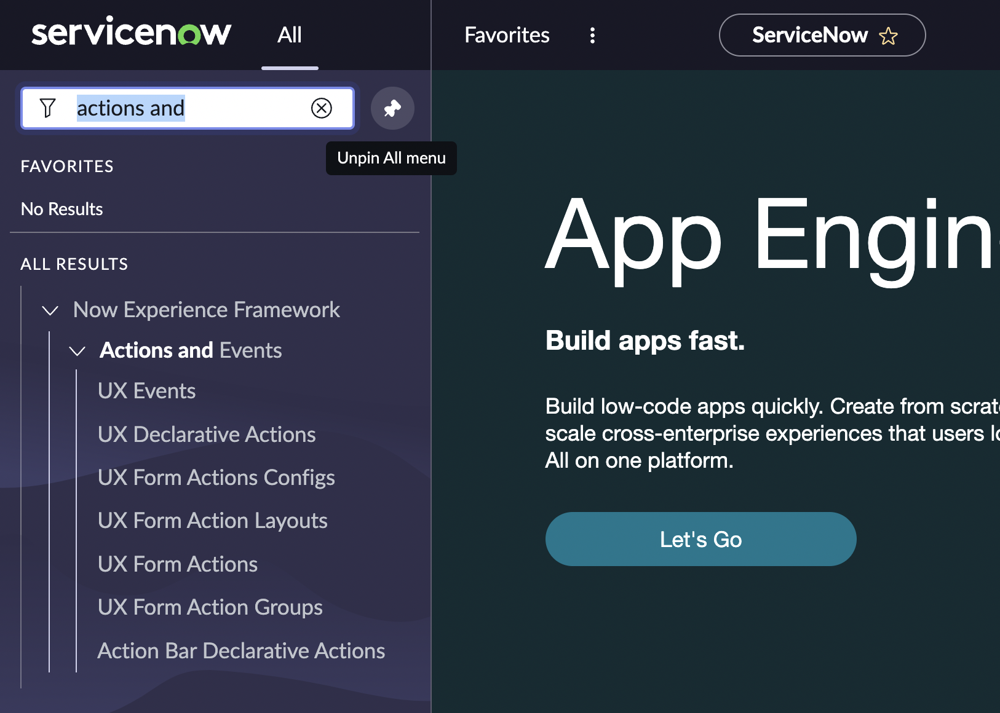

- Since we want to add a button on the Case (`sn_customerservice_case`) form which is part of the "CSM/FSM Configurable Workspace" Workspace we can already set our Update Set accordingly. (Staying in "Global" is possible, but complicates things later on).

## Step 1: Define a Declarative Action

From a high level there are two steps involved in getting a button to appear on a Configurable Workspace. (1) You need to define the button and (2) you need to tell ServiceNow where you want it to show up. What follows is step 1.

1. Open **Now Experience Framework > Action Bar Declarative Actions** and click "New" create a new Action Assignment (`sys_declarative_action_assignment`).
2. Enter in a label e.g. "Our button".
3. Enter an action name, the convention is to write this in kebab-case like this: "our-button".
4. Keep the "Implemented as" field as "UXF Client Action"
5. On the "Specify client action" click the lookup button. 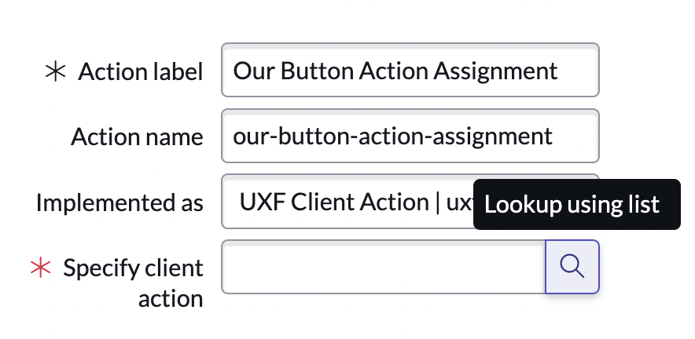
6. In the Lookup Window click "New" to create a new Action Payload Definition (`sys_declarative_action_payload_definition`) record 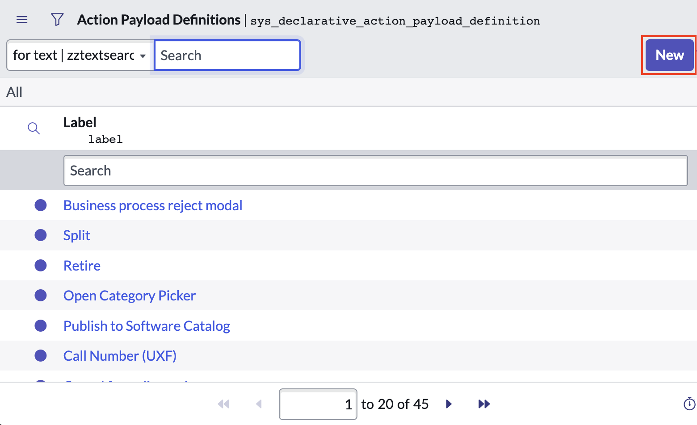
   - Enter in a key, the convention is SCREAMING_SNAKE_CASE like this: "OUR_BUTTON"
   - Make the label the same as the key
   - Under "Applicable to" only select "form"
   - Typically under payload we would specify something to make our button actually do something. But that's for a different tutorial, so we leave it empty here. 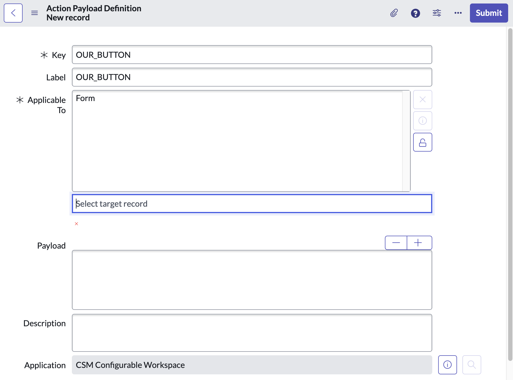
   - Click submit.
7. Important: Keep the "Table" field on the Action Assignment set to "Global". This won't impact where the button will show up, but it _does_ impact whether the records we set up later (i.e. in the UX Form Action form) are able to access this Declarative Action Assigment.
8. Submit/Save the Action Assignment record. 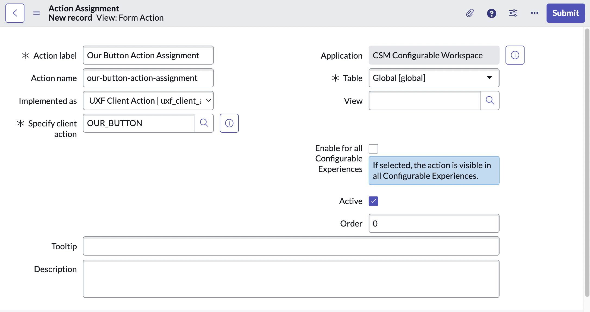

## Step 2: Add a layout item to an existing Layout

The second step is about telling ServiceNow "Hey, remember that button that we declared? _This_ is where it should appear."

1. Open the UX Form Action Layout list view (`sys_ux_form_action_layout`) via **Now Experience Framework > UX Form Action Layouts**.
2. Try to find an existing Layout record which covers the table to which the record belongs which you want to manipulate in the Configurable Workspace. In our case we want to add a button to the Case form which belongs to the `sn_customerservice_case` table, which is covered by the "Case Actions" UX Form Actions Layout. (If one doesn't exist, you can create one yourself, but that's not covered in this tutorial) 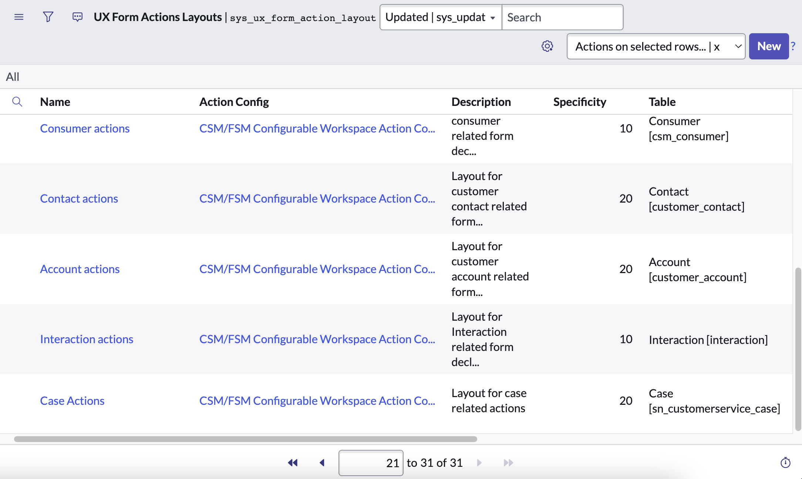
3. If you click on "Case Actions" and load the record you may notice that it is in the "CSM Configurable Workspace" scope. Luckily we switched to the right scope in Step 0, but if you're doing something slightly different, you'll want to pay attention to the Scope here.
4. Scroll down to the related list "UX Form Action Layout Items". Click on the "New" button to create a new, linked Layout Item 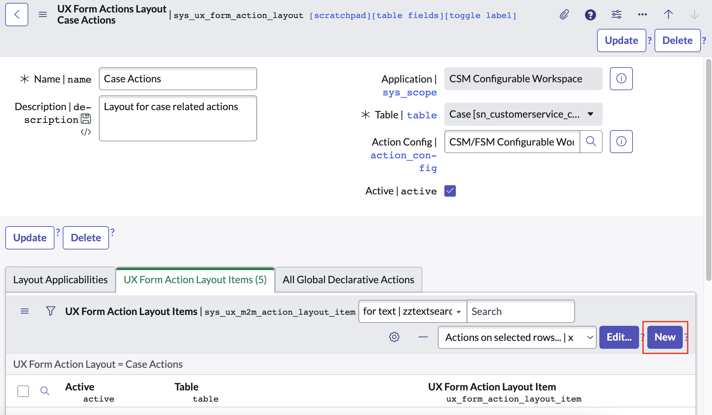
5. You'll be brought to the new record form for a UX Form Actions Layout Item.
   - Start off by setting the "Table" field to the table of the record which you want to add a button to. In our case this is `sn_customerservice_case`. (We start with this because it affects our selection in the "Action" field.)
   - As name enter "Our Button Layout Item"
   - As label enter "Our Button 👋". This is what will be shown as the button's text.
   - At the "Action" field click the lookup Icon to open the Lookup Window and click "New". (Note that we're opening a "Form Action" new record from a "UX Forms Actions Layout Item" new record form. ServiceNow prevents us from opening a new lookup window since we're already inside a lookup window. That's why the lookup icon is disabled here.) 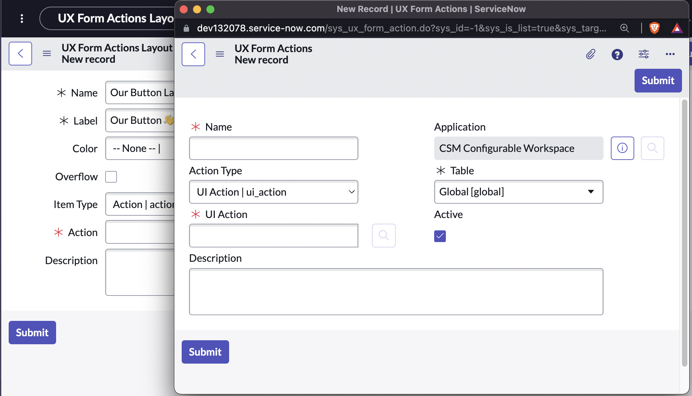
     - In the Form Action new record window enter the following:
     - For "Name" use "Our Button Form Action".
     - Set "Action Type" to "Declarative Action"
     - Set the "Table" to "Case" (`sn_customerservice_case`)
     - In the "Declarative Action" field we can't use the lookup functionality anymore, but we can type in "\*\*" to get a list of options without opening a window. You should find the Declarative Action Assignment we defined in Step 1. here. Select it and save the record. 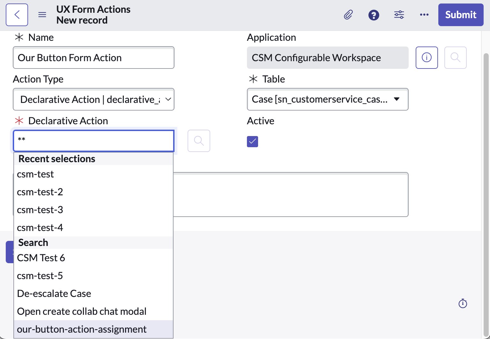
   - Submit/Save the "UX Form Actions Layout Item" record 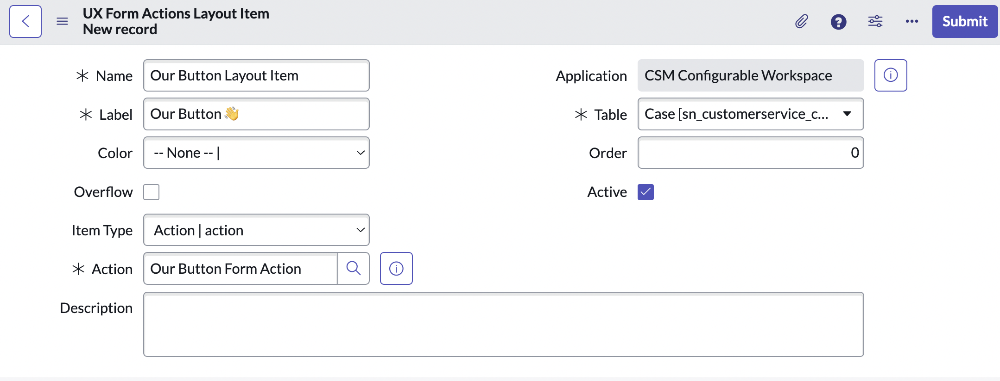
6. With the UX Form Actions Layout Item saved, you've told ServiceNow where to display the Declarative Action you defined in Step 1. Go ahead and navigate to a Case record on the CSM/FSM Configurable Workspace to see it. 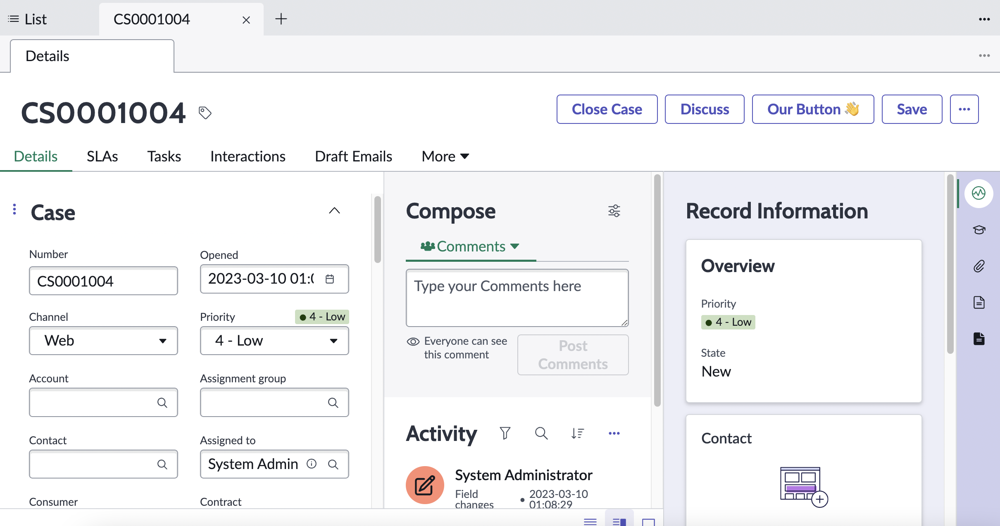

Note that the button doesn't do anything yet. For that we would need to define a Payload in the Payload Action Definition in Step 1.6 and map it to a Handled Event in the Configurable Workspace, but that's for a different tutorial.

## Additional remarks

While researching this topic online I found several people that have paved the way before me.

- [Arnoud Kooi's Declarative Action From Record Page Video](https://www.youtube.com/watch?v=C8KDDHUvNO8)
- [Brad Tilton's Add a Button to the List Component Video](https://www.youtube.com/watch?v=lTDa8nFRvmU)
- [Roy Walliman](https://www.servicenow.com/community/user/viewprofilepage/user-id/270338)'s internal instructions at BitHawk

What's interesting though is that each tutorial seemed quite different to me, even though they're trying to achieve similar things. You might realize the same when you watch their tutorials.

What I did differently is that I separated (1) the declaring of the button from (2) making the button do something. And I did everything within the same scope as the workspace. This simplifies things.

## Resources

- [Official ServiceNow Guide on Declarative Actions](https://www.servicenow.com/community/next-experience-articles/introduction-to-declarative-actions/ta-p/2332003)
- [Arnoud Kooi's Declarative Action From Record Page Video](https://www.youtube.com/watch?v=C8KDDHUvNO8)
- [Brad Tilton's Add a Button to the List Component Video](https://www.youtube.com/watch?v=lTDa8nFRvmU)
