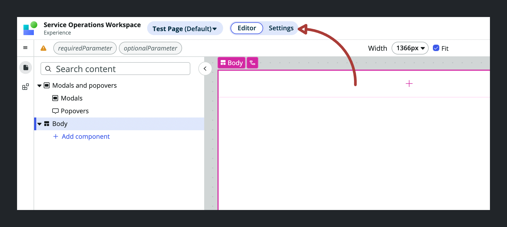
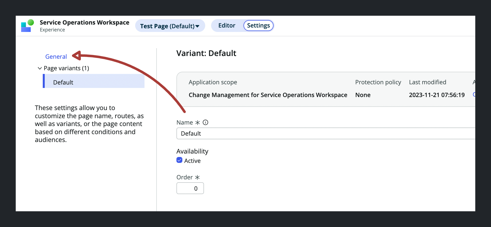
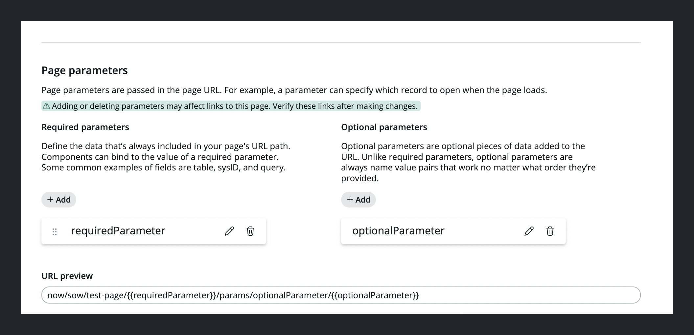

import { Steps } from 'nextra/components'

# Defining page parameters on UIB Pages

## Steps

<Steps>
### Click on the Settings tab inside UI Builder

Open your page in UI Builder and switch to the Settings tab

### Navigate to the "General" section

### Add your desired parameters in the Page parameters section

</Steps>

# Resources

[Adding Page Parameters - ServiceNow UI Builder Course](https://developer.servicenow.com/dev.do#!/learn/courses/vancouver/app_store_learnv2_uibuilder_vancouver_ui_builder/app_store_learnv2_uibuilder_vancouver_create_pages_in_ui_builder/UCP_AddingPageParameters_vancouver)