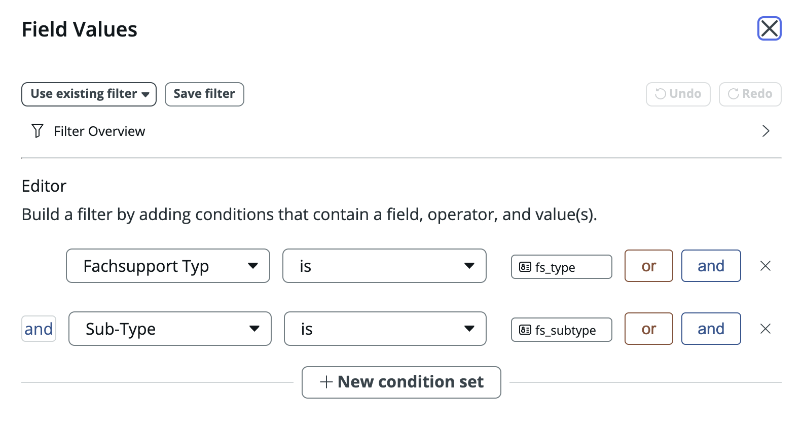
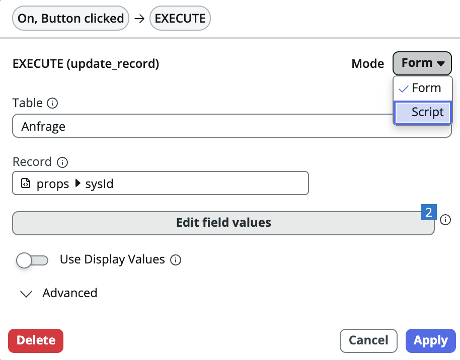

## Requirement

We want a workspace page to update a record with one or more values.

## Solution

There are two main ways to update a record in UI Builder and both involve using the `Update Record` data resource.

### Using the UI

1. Click on "+" to open a new data resource
2. Select the OOB `Update Record` data resource
3. Click add and give it an id, for instance `update_record`
4. In an event mapping (for instance on a button click) add an event handler and select the `update_record` data resource
5. Configure the `Table` and `Record` (`sys_id`)
6. Click on `Edit field values` to specify which fields to update
7. (This is a bit counterintuitive) Add the fields you want to change *as `is` filters*. If you want to change 2 fields, you need to add them as 2 `is` filters.
    
8. Click Submit

### Using scripting

(Steps 1-4 are the same as above)

1. Click on "+" to open a new data resource
2. Select the OOB `Update Record` data resource
3. Click add and give it an id, for instance `update_record`
4. In an event mapping (for instance on a button click) add an event handler and select the `update_record` data resource
5. In the event mapping configuration select `Script` mode
    
6. In the `Script` section add something like the following:
    ```js
    function handler({api,event, helpers, imports}) {
        let fields = "value=" + api.state.date_format; // Note query syntax

        api.data.update_record_1.execute({
            table: "sys_properties",
            recordId : api.data.getsystemproperty.output.sysId,
            templateFields: fields,
            useSetDisplayValue: false
        });
    }
    ```
