# Opening a modal with declarative actions

## Prerequisites

1. If you're on a developer instance and you want to follow along, make sure you install CSM and/or FSM/CSM plugins. You can do so by going to **System Definition > Plugins** in the menu and searching for "CSM".
   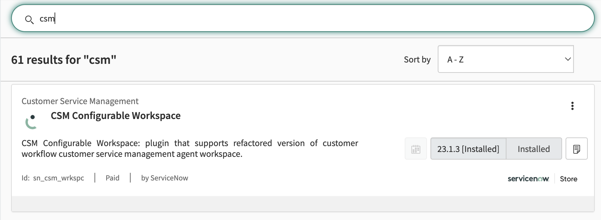
2. This tutorial assumes you already have a button configured inside Configurable Workspaces. If not, you can follow the preceding tutorial to do so [here](/adding-an-action-bar-button-to-a-configurable-workspace).

## Step 1: Create a Page & Variant in UI Builder

1. In the Application Navigator navigate to **Now Experience Framework > UI Builder** to open UI Builder.
2. On the UI Builder Home Screen under Experiences find and click on the CSM/FSM Configurable Workspace experience.
   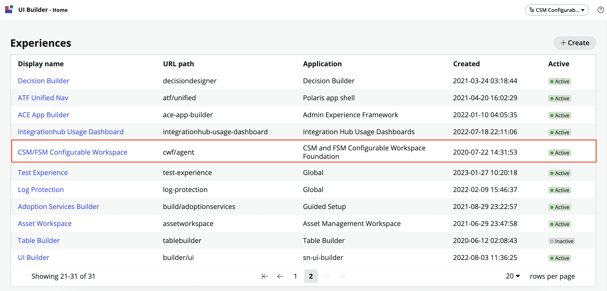
3. Click on the + button next to Pages and variants.
   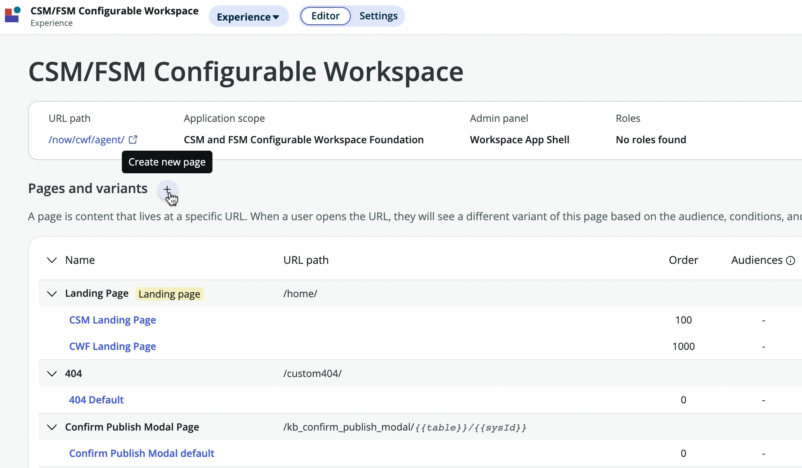
4. Click on "Create a new page" when asked to choose between creating a new page and creating a new variant.
5. On the template selection screen click on the button on the top right "Create from scratch instead".
   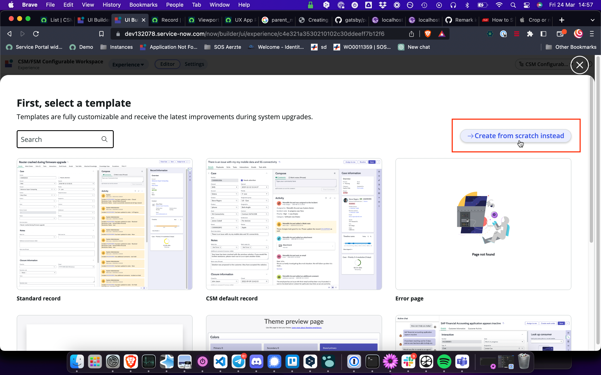
6. Set the Page name to "Crazy Page", this should autofill the URL path as "crazy-page". Finally click continue to proceed. Note: The URL path is what we need when defining the mapping between our button and the modal.
   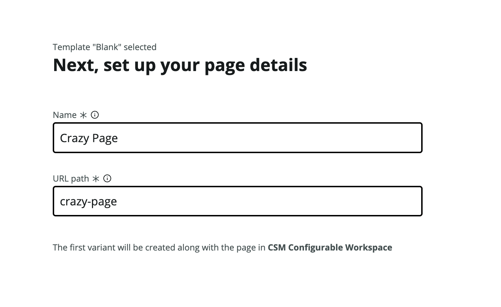
7. On the next screen add two URL Parameters for our page. One called `sysId` and one called `table`. We'll use these to pass the `sys_id` of the record and the name of the table. Finally click "Looks good" to proceed.
   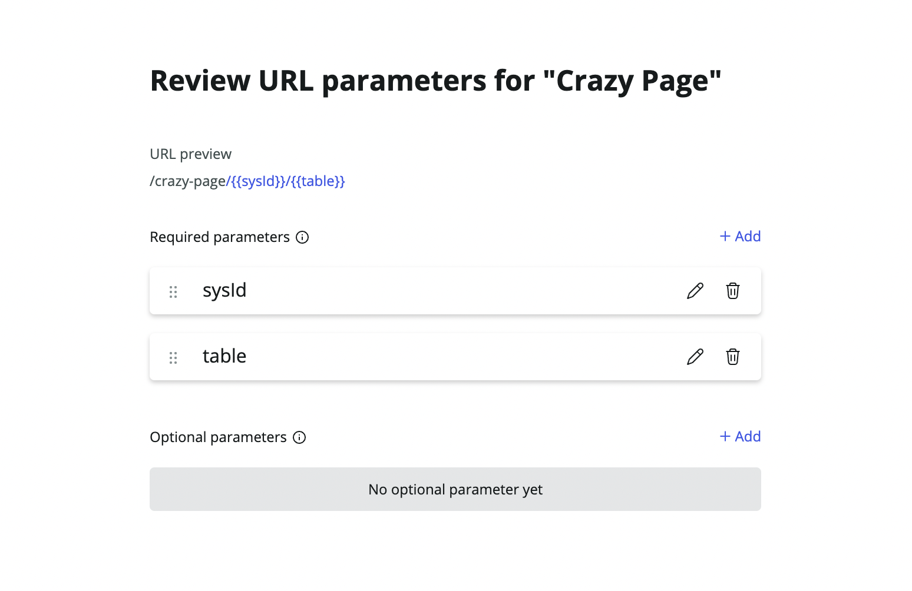
8. On the next screen ("Tell us about your variant") give your Variant a name. This will be what shows up in the Page overview. Let's call our variant "Crazy Variant" Leave the rest as is.
   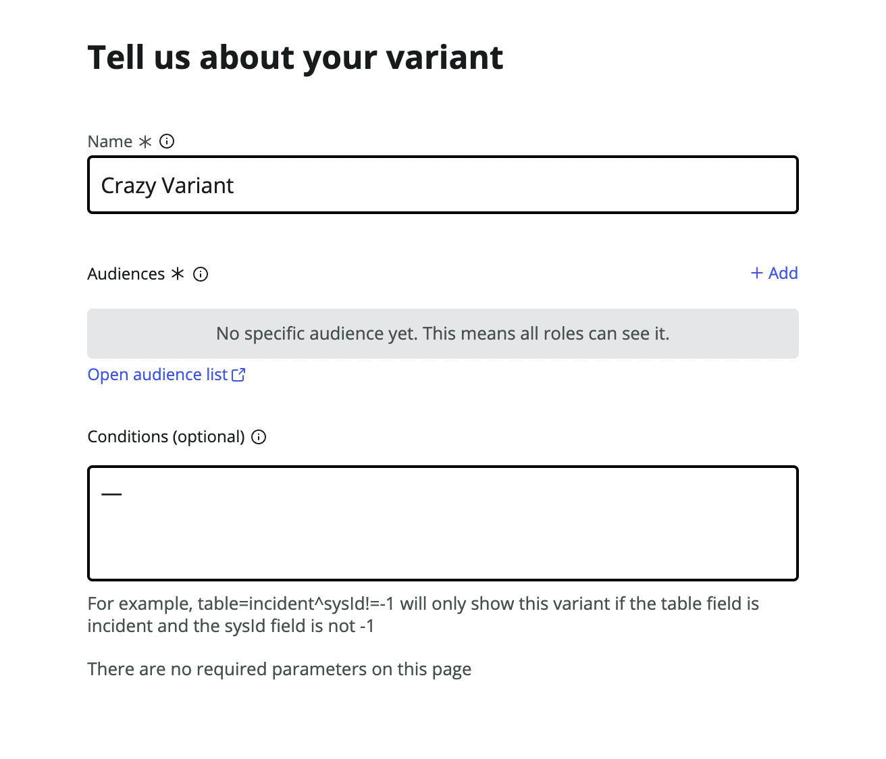
9. Our new Page & Variant should now show up in the overview of Pages. Click on it to open it in UI Builder. Note: Keep this tab open. As of this writing there is a weird bug in Servicenow that causes this Variant Collection to disappear from the overview once you fill in one of the fields in the next section)
   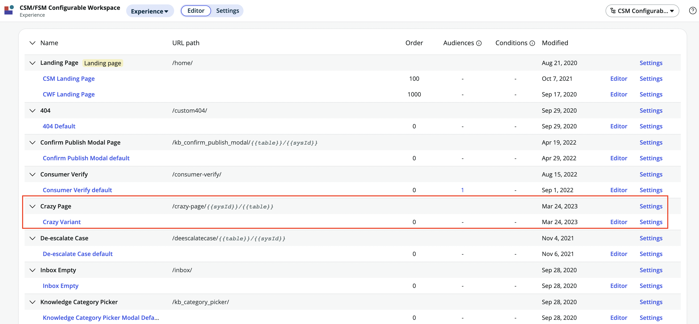

## Step 2: Design your Variant

1. Add whatever components you want to display on the Page. In our case we can pick the "List" component which takes a `table` as a parameter and displays a list of records for that table. Click "+ Add component" underneath the Body element in the left pane and search for "List" in the Component search. Click it to place it on the canvas.
2. With the "List" component selected click on the "Table" field in the Config pane on the right. Switch to Bind data and dot-walk to the `table` prop like so: `@context.props.table`.
3. Scroll down a bit in the Config pane until you reach the "Title" field. Switch to Script mode.
   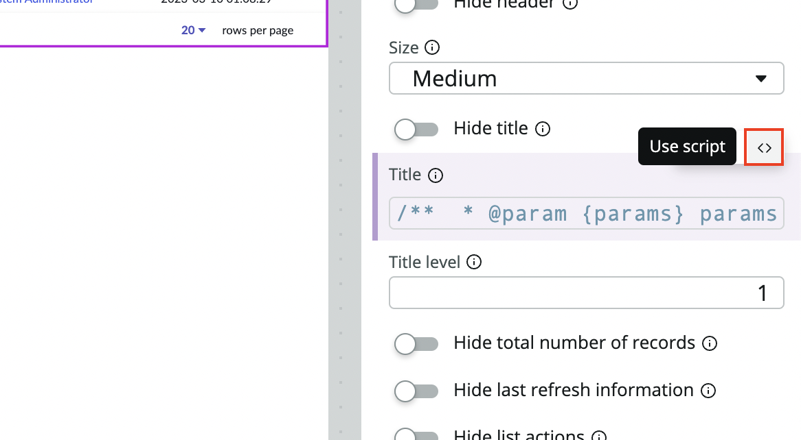
4. Enter the following script where we pass the `sysId` received through the URL parameter as a JS template variable.

    ```js
    function evaluateProperty({ api, helpers }) {
    	return `Only ${api.context.props.sysId}`;
    }
    ```

    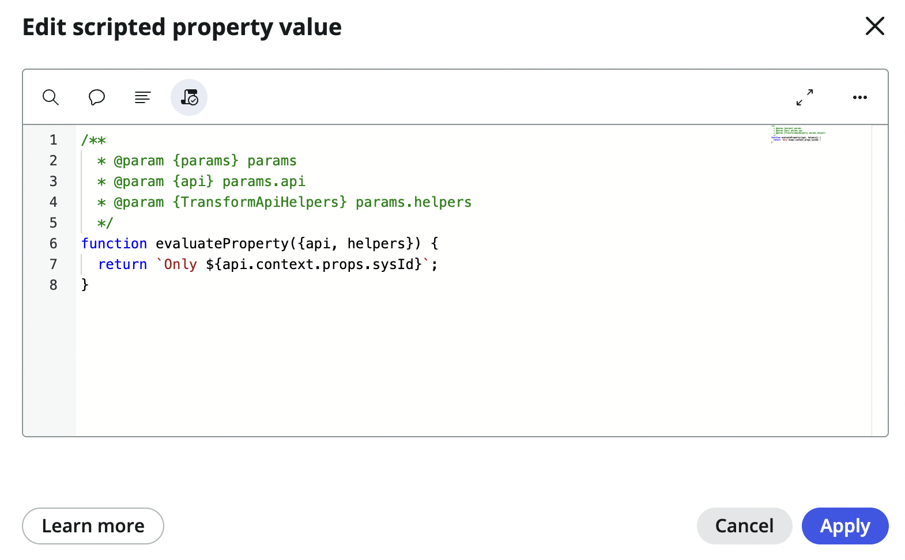

5. Click "Apply" for the script and "Save" on the top right of the window to save your changes. Now the `table` and `sysId` variables are configured to be passed from from the modal, through the URL into the our Variant.

## Step 3: Configure the Variant

1. Click on the hamburger menu on the top left and navigate to Developer > Open variant collection record. This will open the `sys_ux_screen_type`.

2. On the `sys_ux_screen_type` record open the UX App Routes tab in the Related Lists section. It should have one entry called "Crazy Page" based on what we defined in Step 1. Click it to open the UX App Route record.
   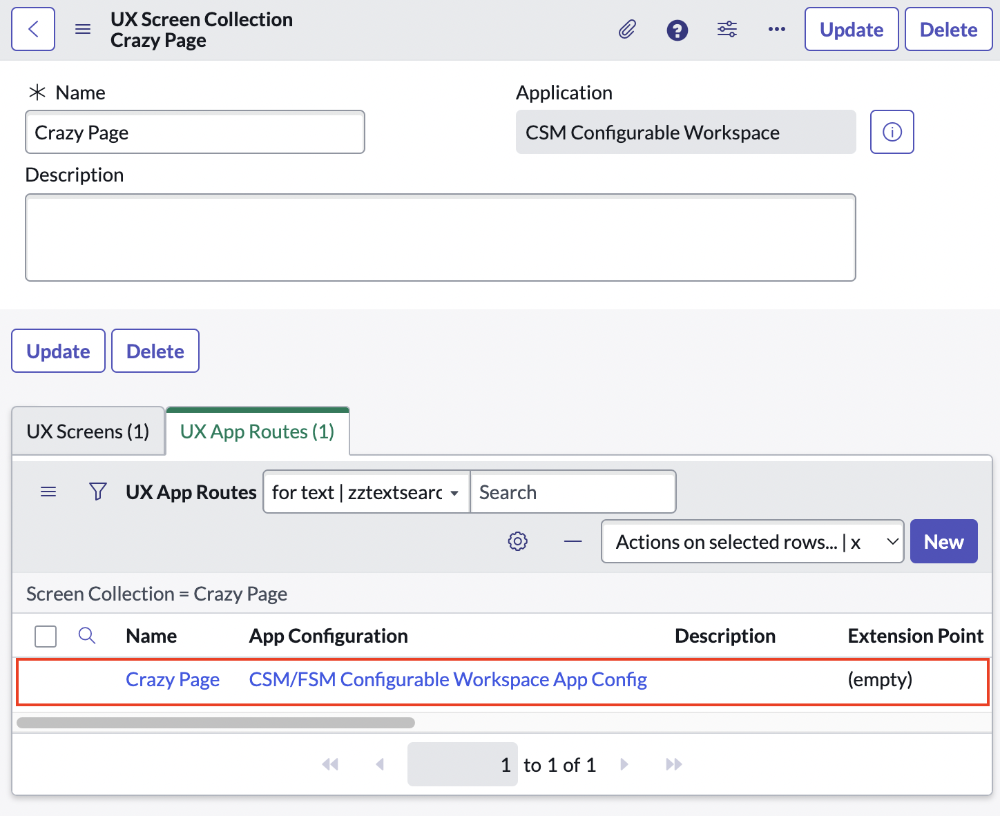

3. Here we need to set the Parent Macroponent (`parent_macroponent`) to whatever page we want our Page to appear within.

    - Since we want to create a Modal on the Record page we need fill in the CSM/FSM Configurable Workspace Record Macroponent here. But if you click on the lookup icon you may find multiple Macroponents listed all with the name "Record". Which one do we need to pick?

    - To answer this we need to open the CSM/FSM Configurable Workspace Experience in UI builder in a new tab. There, in the overview of Pages, we need to look for the Page/Macroponent where want to the Modal to appear. In our case it's the Record so the "Record Default" variant sounds like the right one. 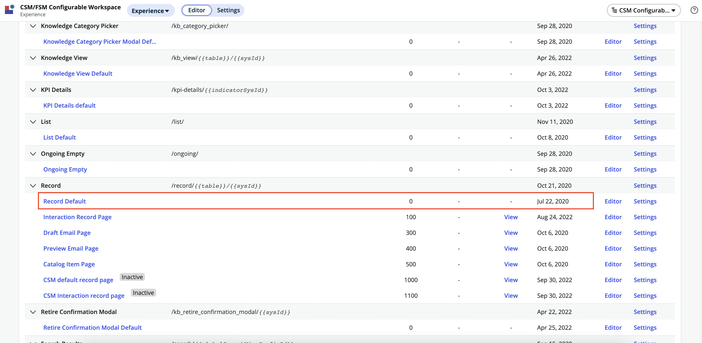
    - Click on it to open it and click on the hamburger menu on the top left again and navigate to "Open page definition".
    - On the Page Definition right click the top bar and select "Copy sys_id" to grab the `sys_id`.
    - Go back to the tab where you have the `sys_ux_app_route` record open. Use the SN Utils double click function to double click on the name of the "Parent Macroponent" field to open its machine readable value in a browser alert modal.
    - Paste in the `sys_id` from your clipboard and click save and see the display name ("Record") appear. 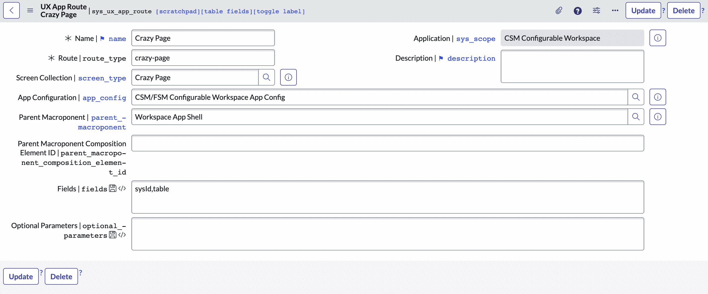

5. The Parent Macroponent Composition Element ID defines which part of the Macroponent our UI Builder Page should appear in. Since we want it to appear in a modal we can use the CSM/FSM Configurable Workspace's built-in modal, which has Element ID `modalContainerViewport`. 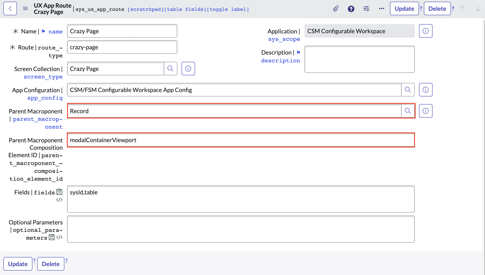

6. Leave the other fields as is and click "Update" to save the record.

7. Note: Make sure to keep your UI Builder Page open in a tab. As of this writing there is a weird bug which makes it disappear from the Experience page once you set the Parent Macroponent Composition Element ID.

## Step 3: Create a UX Add-on Event Mapping

At this point we've created a Page & Variant and we've told ServiceNow we want it to show up on the CSM/FSM Configurable Workspace record Macroponent linked to the `modalContainerViewport`.

In the [previous tutorial](https://jessems.com/posts/2023-03-13-adding-an-action-bar-button-to-a-configurable-workspace) we added a button to the Record page of a Workspace, but we stopped short of making that button do anything.

What's left is for us to connect the button with the Modal. What's more we want to pass information from the Record to the Modal. What's left for us is mapping the Button click event to the Modal launch event. Te way this is done is through a UX Add-on Event Mapping Record (sys_ux_addon_event_mapping).

1. Unfortunately there is no menu link for this table, so you need to open it directly by typing in `<instance-name>.service-now.com/sys_ux_addon_event_mapping_list.do` into your browser.
2. Click "New" to create a new record.
3. Enter in a name for your map. In our case "Crazy Page Map".
4. Select "ui_action_bar" as the "Source elemnt ID".
5. Select the Declarative Action Assignment we defined in [the previous tutorial](/adding-an-action-bar-button-to-a-configurable-workspace) for the field "Source Declarative Action". In our case that's "crazy-button".
6. Set the macroponent to the CSM/FSM Configurable Workspace "Record" Macroponent using the `sysId` we looked up in Step 3.4.
7. Selecting a Macroponent should load the options for the "Target Event" dropdown. Set this field to "[Record Page] Open modal". (If you want to trigger a different event, such as opening a tab, you need to select a different target event here.)
8. Finally in the "Target Payload Mapping" field we need to paste this JSON object. It defines which fields we'll be able to send to the Modal and you don't have to alter the structure for other use cases. We'll only be using "route" and "fields".

    ```json
    {
    	"type": "MAP_CONTAINER",
    	"container": {
    		"route": {
    			"type": "EVENT_PAYLOAD_BINDING",
    			"binding": {
    				"address": ["route"]
    			}
    		},
    		"size": {
    			"type": "EVENT_PAYLOAD_BINDING",
    			"binding": {
    				"address": ["size"]
    			}
    		},
    		"fields": {
    			"type": "EVENT_PAYLOAD_BINDING",
    			"binding": {
    				"address": ["fields"]
    			}
    		},
    		"params": {
    			"type": "EVENT_PAYLOAD_BINDING",
    			"binding": {
    				"address": ["params"]
    			}
    		}
    	}
    }
    ```

9. Finally click Submit to save the record.
   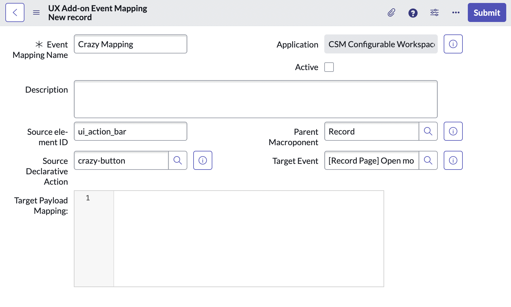

## Step 4: Define the Payload

The last remaining step is for us to define the payload of the event. Back in [the previous tutorial](/adding-an-action-bar-button-to-a-configurable-workspace) we left this field blank.

1. Navigate to Now Experience Framework > Actions and Events > Action Bar Declarative Actions and find the Declarative Action we defined in the previous tutorial. In our case it was called "Crazy Button"
2. On the "Specify client action" field click the Record Preview button and open the record in a new tab.
   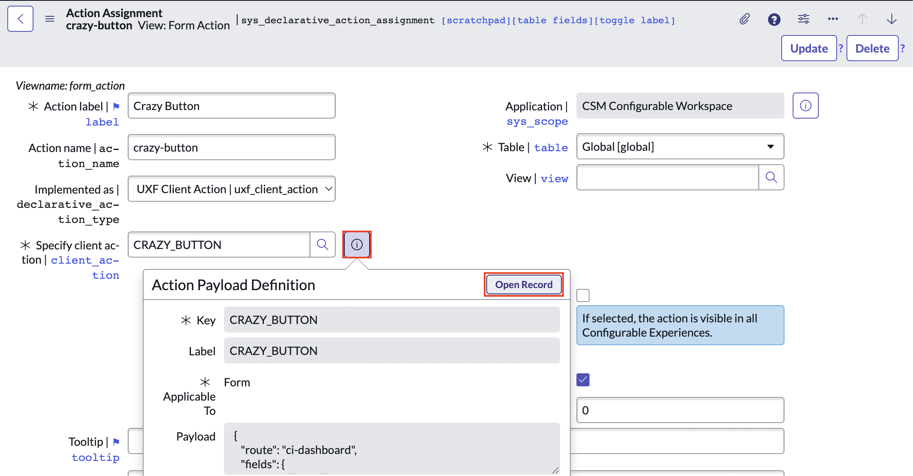
3. In the Payload field fill in the JSON object below. The `route` key tells SN where to look for our Page and we can use the `field` key to pass variables from the current context:

    ```js
     {
       "route": "crazy-page",
       "fields": {
         "table": "{{table}}",
         "sysId": "{{sysId}}"
       }
     }
    ```

4. Finally click Update to save the record. 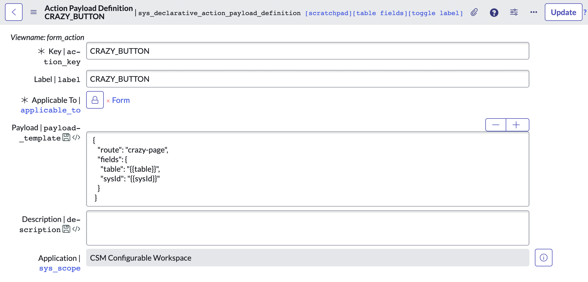

## Step 5: test your button

Now open the CSM/FSM Configurable Workspace, navigate to the Case Record and test the button.

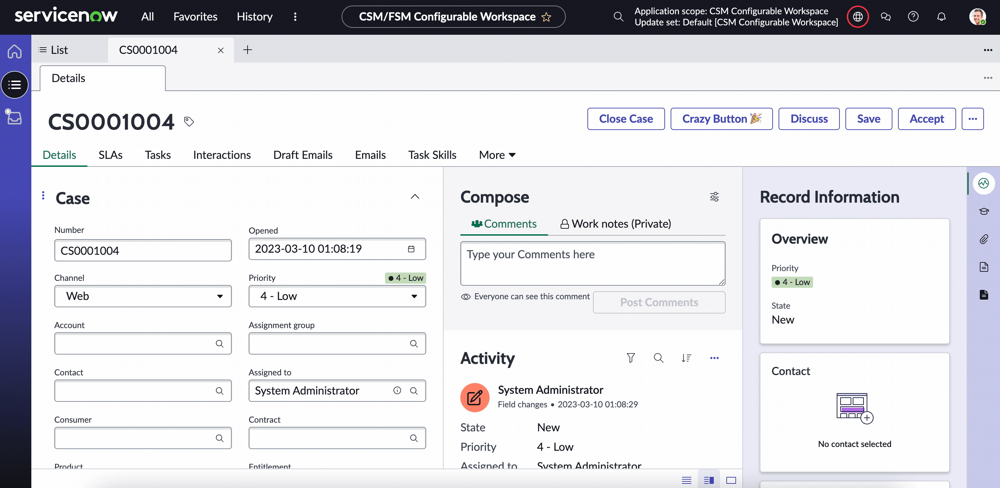

If you want to change the modal size, you can do so easily by adding a `size` key to the payload object in Step 4.3. Possible sizes are `sm`, `md`, `lg` and `fullscreen` e.g.

```js
  {
    "route": "crazy-page",
    "size": "fullscreen",
    "fields": {
      "table": "{{table}}",
      "sysId": "{{sysId}}"
    }
  }
```

## Resources

-   [Official ServiceNow Guide on Declarative Actions](https://www.servicenow.com/community/next-experience-articles/introduction-to-declarative-actions/ta-p/2332003)
-   [Arnoud Kooi's Declarative Action From Record Page Video](https://www.youtube.com/watch?v=C8KDDHUvNO8)
-   [Brad Tilton's Add a Button to the List Component Video](https://www.youtube.com/watch?v=lTDa8nFRvmU)
-   Special thanks to [Roy Wallimann](https://www.servicenow.com/community/user/viewprofilepage/user-id/270338) who wrote an internal BitHawk tutorial on triggering modals in workspaces

```

```
